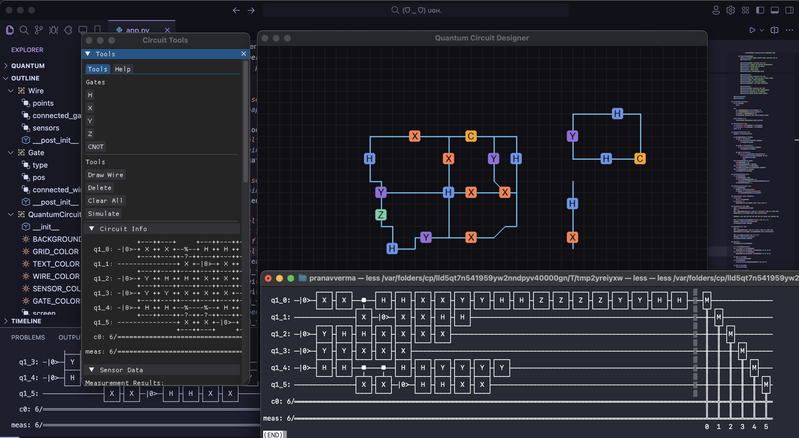

# Quantum Circuit Designer

A visual quantum circuit design and simulation tool built with Python. This application allows users to create, visualize, and simulate quantum circuits.

## Features

- Interactive quantum circuit design interface
- Real-time visualization of quantum gates and wires
- Support for common quantum gates (H, X, Y, Z, CNOT)
- Circuit simulation using Qiskit
- Grid-based design system with snap-to-grid functionality
- Live circuit diagram visualization
- Measurement results analysis
